# DevDash

Task 1's developer productivity dashboard, upgraded with the Task 4 frontend features and architecture. This repository remains frontend-only: it includes the typed API client and a mock adapter, while the API can be run separately.

## Features

- Dashboard KPIs, deadlines, activity, project progress, task assignment, search and filters.
- Registration and login, protected routes, professional profiles, member profiles, settings and account preferences.
- AI task suggestions, prioritisation and project summaries. Suggestions are reviewed and confirmed by the user.
- Typed services with HTTP and mock adapters; same-origin Next.js BFF keeps session tokens in HttpOnly cookies.
- Responsive layouts, light/dark/system themes, accessible UI, and loading, empty, error and retry states.

## Screenshots

Fresh screenshots of the updated dashboard, captured with synthetic data at 1440x900 and 390x844.

| Screen | Desktop | Mobile |
| --- | --- | --- |
| Welcome | 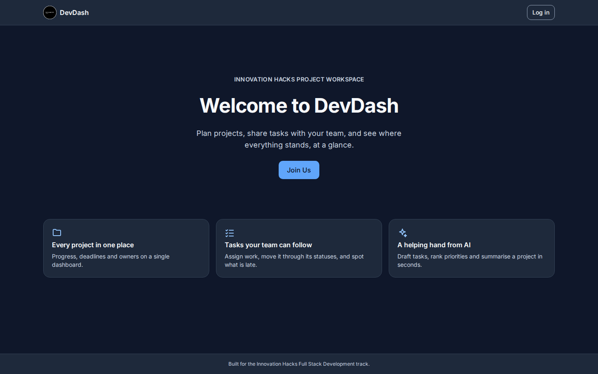 | 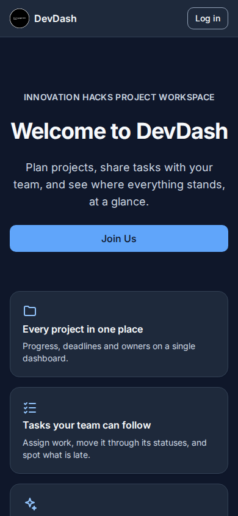 |
| Login | 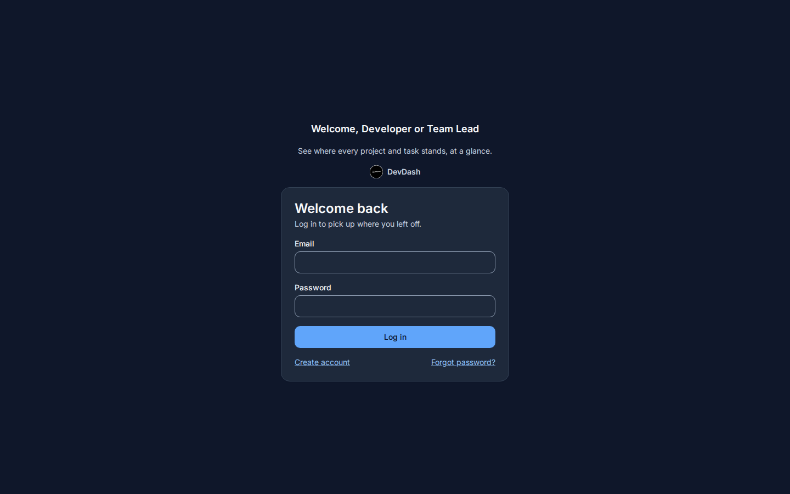 | 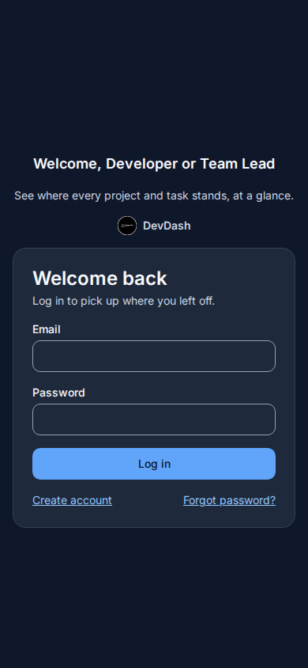 |
| Registration | 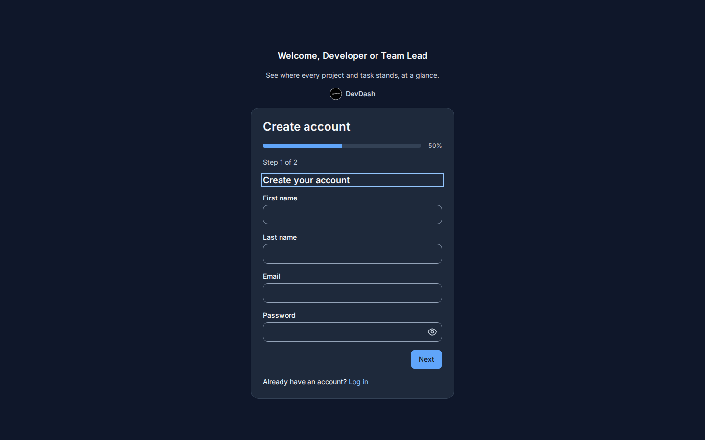 | 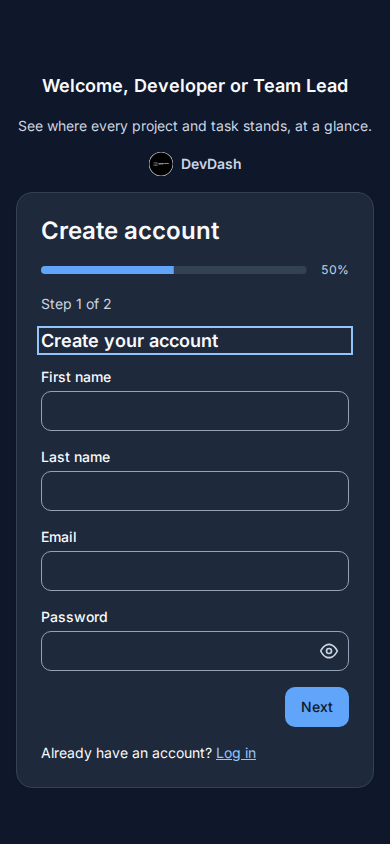 |
| Dashboard | 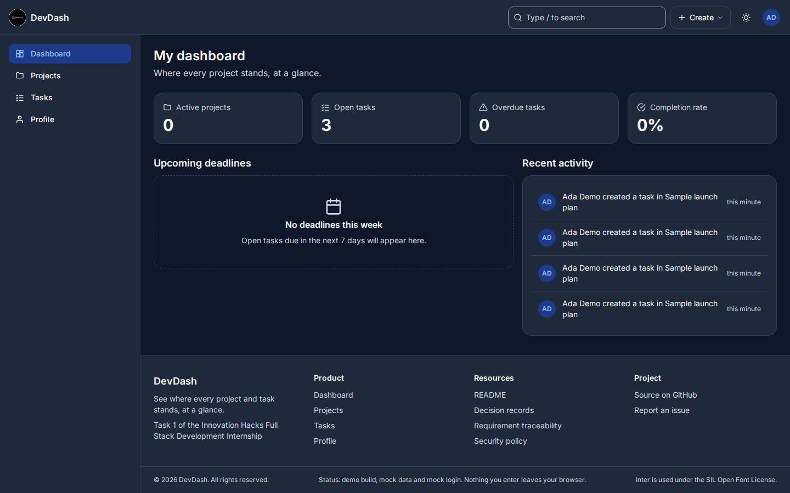 | 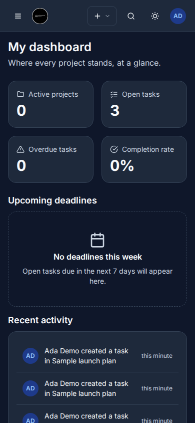 |
| Projects | 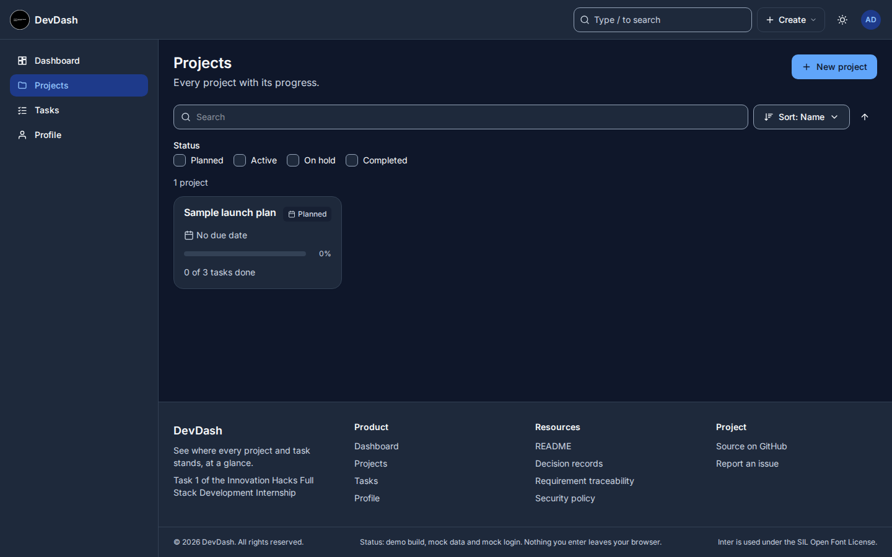 | 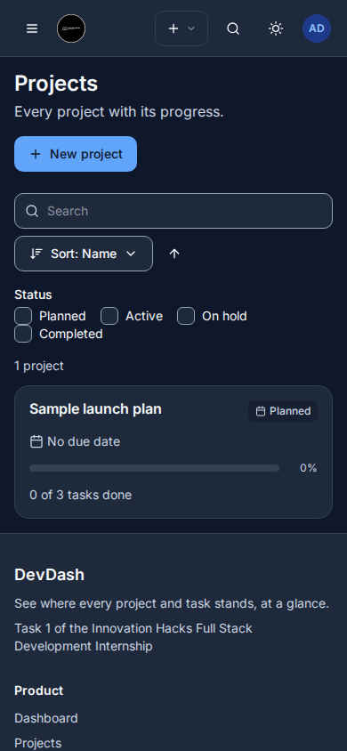 |
| Tasks | 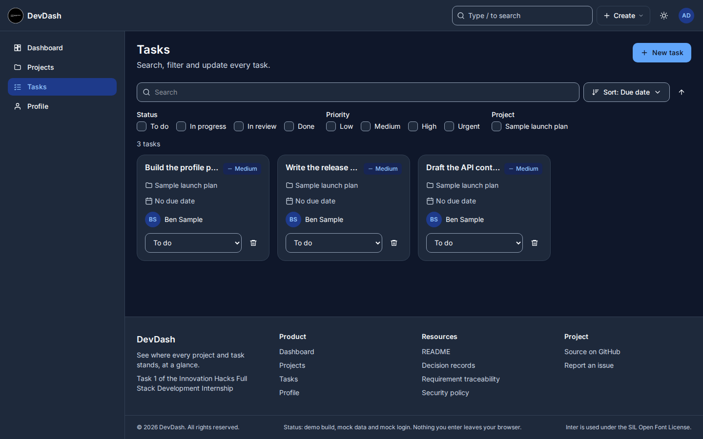 | 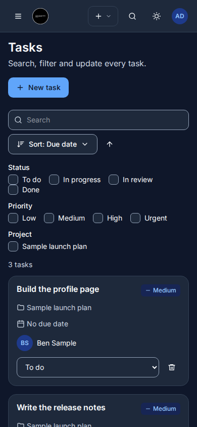 |
| Profile | 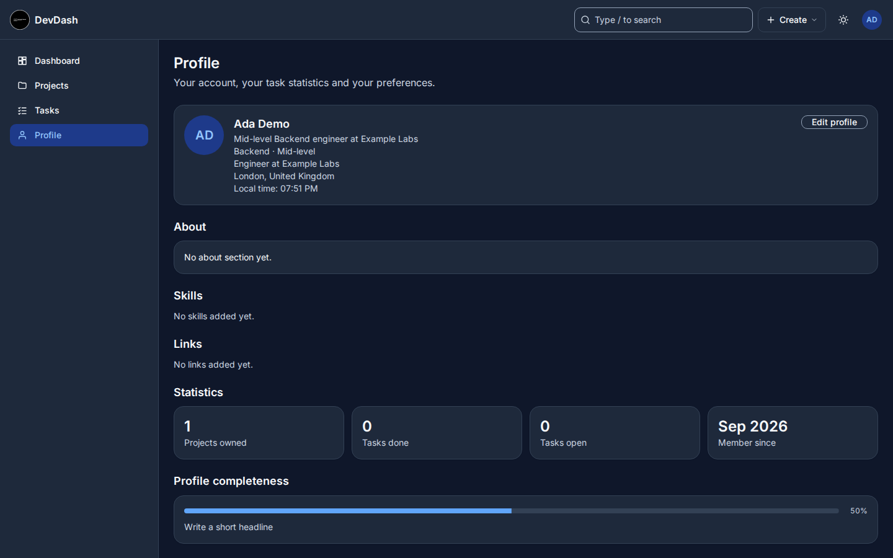 | 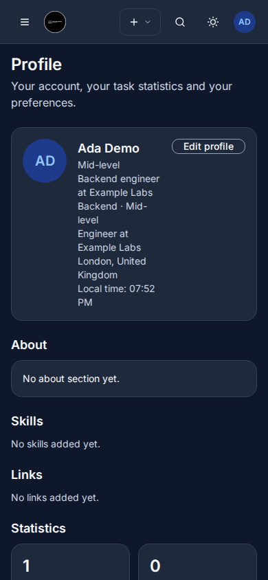 |
| Settings | 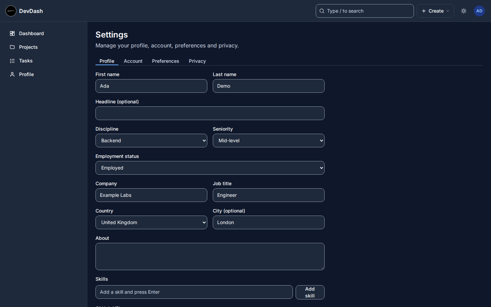 | 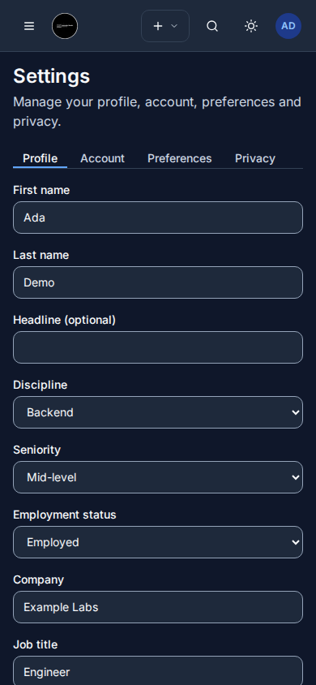 |
| Member profile | 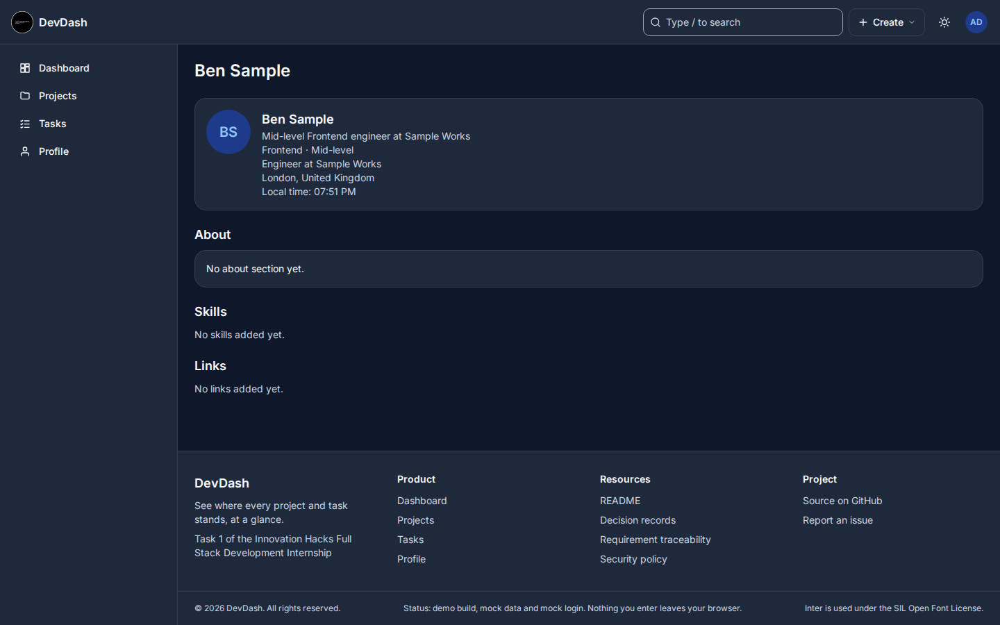 | 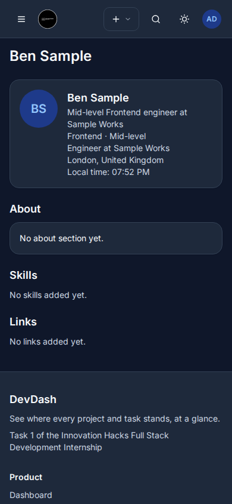 |
| Task assignment | 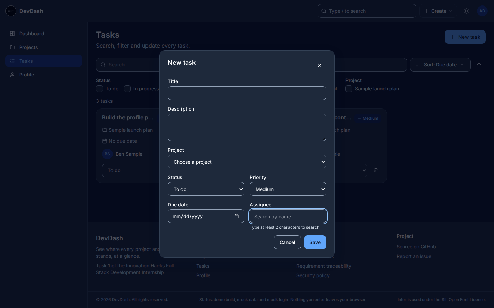 | 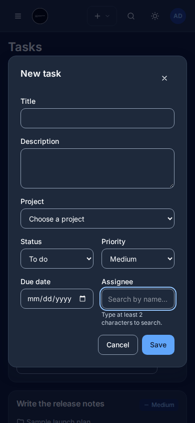 |

## Run locally

Requires Node.js 22 or newer.

```bash
npm ci
cp .env.example .env.local
```

Set `API_BASE_URL` and `SITE_URL` in `.env.local` to connect to the API, then start the frontend:

```bash
npm run dev
```

For frontend-only exploration, set `NEXT_PUBLIC_DATA_SOURCE=mock` in `.env.local` before starting Next.js. The mock adapter provides seeded data and the scenario switcher.

## Routes

| Route | Purpose |
| --- | --- |
| `/` | Welcome page |
| `/dashboard` | Dashboard overview |
| `/projects`, `/projects/[id]` | Browse and manage projects |
| `/tasks` | Search, filter, sort and update tasks |
| `/people/[id]` | View a member profile |
| `/profile`, `/profile/edit` | View and edit your profile |
| `/settings` | Account, privacy and preference settings |
| `/login`, `/register` | Sign in and register |

## Architecture

The Next.js App Router contains the screens and same-origin `/api/bff` route. Features depend on typed service contracts. `src/adapters/http` calls the API through the server layer; `src/adapters/mock` supports local demos and scenarios. Schemas validate service responses, and shared UI components provide accessible forms, dialogs, menus and feedback states.

The API contract snapshot is [docs/api/openapi.json](docs/api/openapi.json), with generated TypeScript types in [src/generated/api-types.ts](src/generated/api-types.ts). Refresh them with `npm run generate:api` after updating the contract.

## Frontend checks

Run `npm run typecheck`, `npm run lint`, `npm test`, `npm run test:e2e`, `npm run test:a11y`, or `npm run gate`. See [DEMO_SCRIPT.md](DEMO_SCRIPT.md), [SECURITY.md](SECURITY.md), [docs/traceability.md](docs/traceability.md), and [docs/adr/README.md](docs/adr/README.md) for usage, requirements and design decisions.
