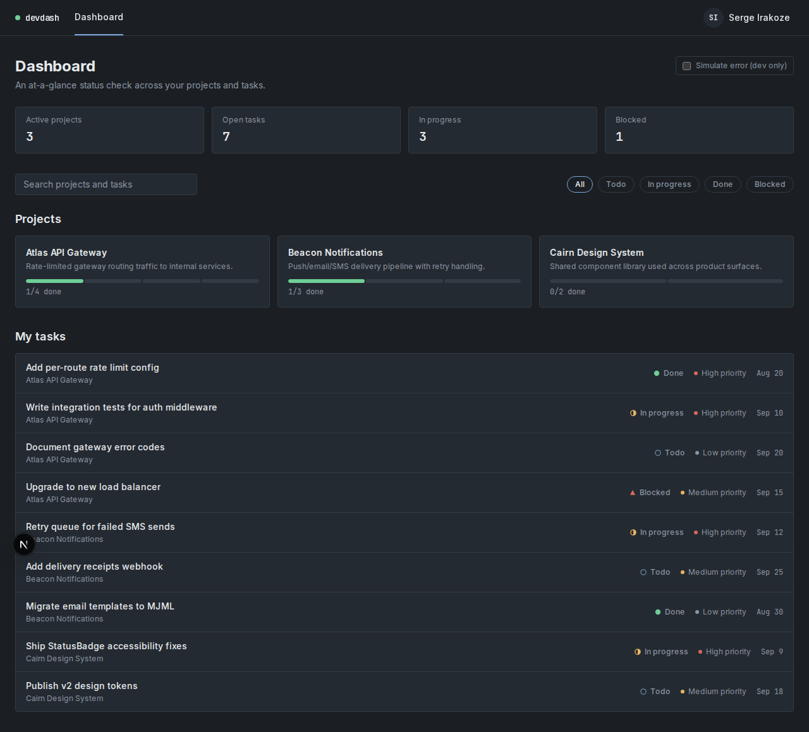
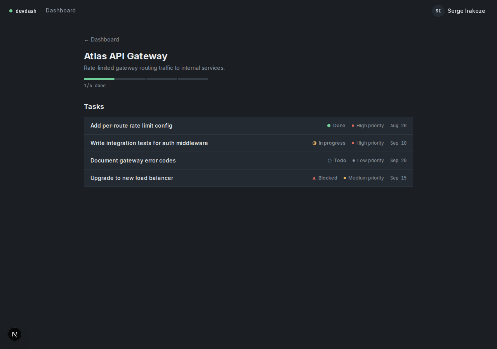
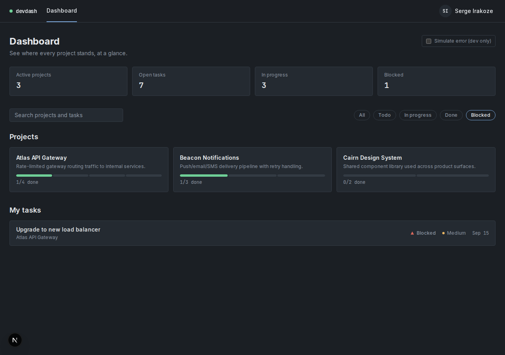
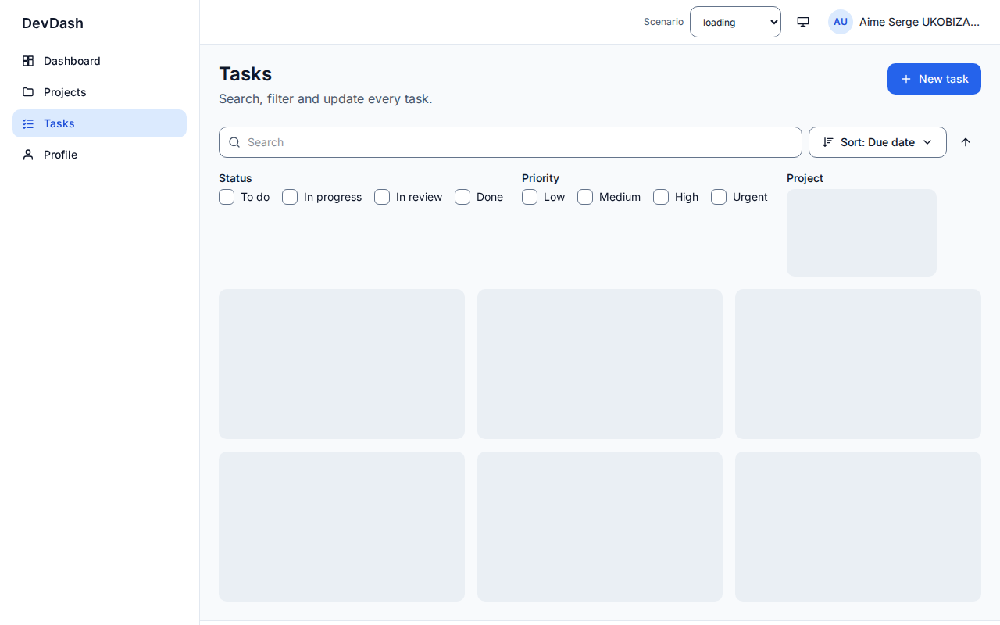
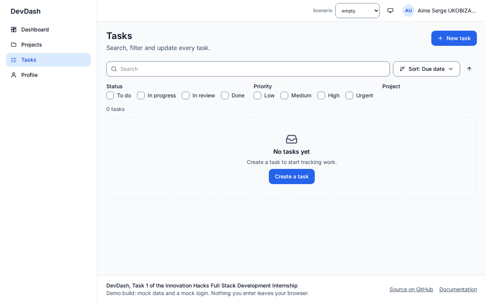
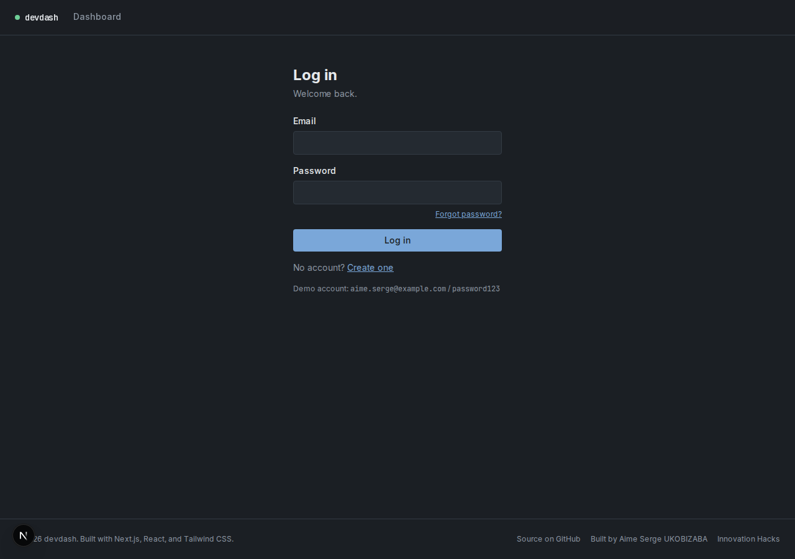
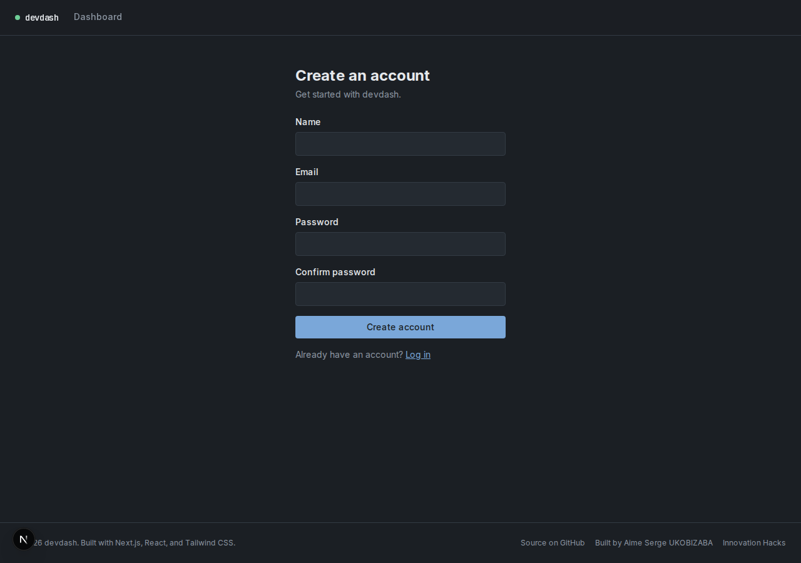
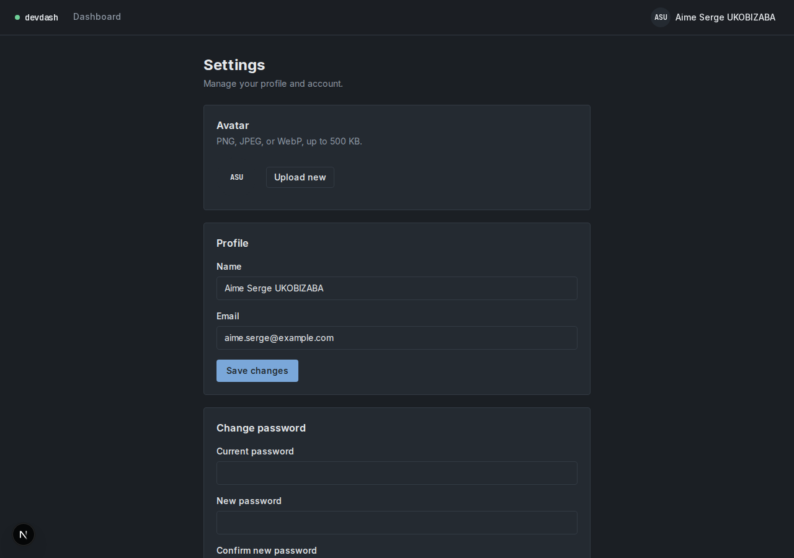

# Developer Productivity Dashboard

An at-a-glance status dashboard for developers checking their own project
and task status — built with Next.js (App Router), TypeScript, and
Tailwind CSS v4.

Built as Task 1 of the Innovation Hacks Full Stack Development
Internship. This is the frontend only: it runs against a typed mock-data
layer (`lib/mock-data.ts`) shaped to match the REST API Task 2 will
provide, so wiring in the real backend later is a drop-in swap of the
fetch functions, not a rewrite of any component.

## Demo

- **Demo video**: _add link here after recording_ — see `DEMO_SCRIPT.md`
  for the shot list (2–5 min, per the internship's Demo Video
  Requirements).
- **Live deployment**: https://task-management-dashboard-two-beta.vercel.app
  — log in with the demo account `aime.serge@example.com` / `password123`
  (deployment steps in [Deployment](#deployment) below; verified with the
  full browser journey and the accessibility/responsive suite against this
  URL).

## Screenshots

| Dashboard (desktop) | Dashboard (mobile) |
| --- | --- |
|  |  |

| Project detail | Task filter applied |
| --- | --- |
|  |  |

| Loading state | Empty state (no matches) | Error state (with retry) |
| --- | --- | --- |
|  |  |  |

| Login | Register | Settings |
| --- | --- | --- |
|  |  |  |

## Feature list

- **Mock authentication & profile** (`/login`, `/register`,
  `/forgot-password`, `/reset-password`, `/settings`) — a full auth UX
  with no real backend behind it: register/login/logout, forgot/reset
  password (the reset link is shown directly on screen instead of being
  emailed — see [Known gaps](#known-gaps--assumptions)), edit profile,
  change password, avatar upload/remove, and account deletion, all
  against an in-memory account store persisted to `localStorage`
  (`lib/mock-auth.ts`). Every other route requires this mock session;
  `proxy.ts` (Next 16's renamed `middleware.ts`) redirects unauthenticated
  visits to `/login`.
- **Dashboard home** (`/`) — the primary landing view: activity summary,
  project grid, and a cross-project "My tasks" list.
- **Project detail** (`/projects/:id`) — a project's own task list, so
  clicking a project card goes somewhere real instead of a dead link.
- **Navigation** — persistent nav bar with a skip-to-content link, a
  non-color-only active-route indicator, a profile menu, and a footer
  with copyright, tech-stack credit, and links to the repo and Innovation
  Hacks.
- **Profile section** — avatar/name in the nav, expandable dropdown,
  keyboard-dismissible (Escape, click-outside), with a working Settings
  link and Sign out action.
- **Project & task cards** — one shared visual system (spacing, corner
  radius, hairline border) driven by CSS custom-property design tokens,
  not per-component styling.
- **Progress indicators** — a segmented bar (git-diff-stat style) per
  project, computed from that project's own tasks.
- **Search & filter** — a live search over project names and task
  titles, plus a status filter (Todo / In progress / Done / Blocked)
  that narrows the task list.
- **Loading / empty / error states** — every data-bound view (stats,
  projects, tasks, profile) has all three, plus success: skeletons that
  mirror the real content's shape, an empty state that distinguishes "no
  data yet" from "your filters excluded everything," and an error state
  with a Retry action.
- **Responsive layout** — verified with headless Chromium at 375px,
  768px, and 1280px: no horizontal scroll at any width, the project grid
  reflows 1 → 2 → 3 columns, and task rows stack their metadata below
  the title on narrow screens.
- **Accessibility** — semantic landmarks (`<nav aria-label>`, `role="search"`,
  `role="group"`), visible focus rings, `aria-pressed`/`aria-current`
  where relevant, and status communicated via icon shape + text, never
  color alone (StatusBadge pairs each of the four statuses with a
  distinct icon: filled circle / half circle / hollow circle /
  triangle).

## Deployment

This app has no backend and no environment variables, so it deploys as-is
to Vercel (or Netlify/Render):

1. vercel.com → **Add New → Project** → import this repo.
2. Leave every setting at its default — the root directory is the repo
   root, and Vercel detects Next.js on its own. No env vars needed.
3. **Deploy**, then open the URL and log in with the demo account
   (`aime.serge@example.com` / `password123`).

Two things worth knowing:

- Everything (the demo account, anything you register, projects, tasks)
  lives in the visitor's own browser `localStorage`, so each visitor
  starts from the same seeded state and their changes never reach anyone
  else. That's the mock-data design, not a bug.
- After login, register, and logout the app does a full page load rather
  than a client-side navigation. Production builds prefetch links, and
  while logged out the route guard answers the prefetch of `/` with a
  redirect to `/login`; the router caches that and would replay it right
  after login, bouncing the user back. Dev mode doesn't prefetch, so this
  only shows up in a production build (`npm run build && npm run start`),
  where the full journey in `scripts/live-e2e-check.mjs` passes.

## Design direction

Rather than a generic SaaS look (glossy cards, drop shadows, an
arbitrary brand-blue badge system), this UI borrows the visual language
developers already use all day: a graphite (not pure-black) canvas like
a code editor, a monospace type role reserved for identifiers and
numbers (task counts, dates, progress fractions) paired with a plain
humanist sans for prose, and a muted diff-inspired status ramp (green /
amber / slate-blue / muted red) instead of a generic color scale.
Progress reads as a segmented bar — closer to `git diff --stat` — rather
than a circular donut, which scales better in a dense list.

## Technology stack

- [Next.js 16](https://nextjs.org) (App Router, Turbopack)
- [React 19](https://react.dev) + TypeScript
- [Tailwind CSS v4](https://tailwindcss.com) (CSS-based `@theme` design tokens)
- [Vitest](https://vitest.dev) + [Testing Library](https://testing-library.com) for component tests
- [Playwright](https://playwright.dev) for local browser verification during development (not part of the test suite)

## Getting started

Requires Node.js 20+ (developed and verified against Node 22).

```bash
npm install
npm run dev
```

Open [http://localhost:3000](http://localhost:3000).

### Other scripts

```bash
npm run build   # production build
npm run start   # run the production build
npm run lint    # ESLint
npm run test    # component test suite (Vitest)
```

### Environment variables

None required. This build has no real backend or third-party services —
`lib/mock-data.ts` simulates network latency and can simulate a failure
via a dev-only "Simulate error" toggle on the dashboard (stripped from
production builds via a `NODE_ENV` check), and `lib/mock-auth.ts` mocks
the entire auth/profile system the same way. A `.env.example` will be
added once Task 2's API introduces a base URL to configure.

### Demo account

A seeded account is always available on a fresh browser profile:
`aime.serge@example.com` / `password123` (shown on the login page
itself). Registering a new account works too — it's saved to
`localStorage`, so it survives reloads within the same browser.

## Project structure

```
app/                       Routes (App Router)
  page.tsx                 Dashboard home (protected)
  projects/[id]/page.tsx   Project detail (protected)
  login/, register/        Auth entry points
  forgot-password/,
  reset-password/          Mocked password-reset flow
  settings/                Profile, avatar, change password, delete account
proxy.ts                   Route-protection gate (Next 16's renamed middleware.ts)
components/
  nav/                     NavBar, ProfileMenu (+ Avatar), Footer
  auth/                    LoginForm, RegisterForm, Forgot/ResetPasswordForm
  settings/                SettingsView (profile, avatar, password, delete)
  dashboard/               DashboardView, StatsStrip
  projects/                ProjectGrid, ProjectCard, ProjectDetailView
  tasks/                   TaskList, TaskCard
  controls/                SearchBar, FilterBar
  shared/                  StatusBadge, ProgressBar, Skeleton, EmptyState, ErrorState
lib/
  types.ts                 Project / Task / User shapes
  mock-data.ts              Mock fetch functions (shaped like the future REST API)
  mock-auth.ts              Mock auth/profile store, persisted to localStorage
  auth-context.tsx          React context wrapping mock-auth for the whole app
  useAsync.ts               Shared loading/error/success hook
  format.ts                 Date formatting, initials
```

## Known gaps / assumptions

- **Filter scope**: search matches project name and task title; the
  status filter narrows tasks only (projects have no status field of
  their own). Priority and project filters are not implemented.
- **Mock authentication, not real auth**: `lib/mock-auth.ts` is a
  plaintext, unsigned, client-only stand-in — it exists to demonstrate
  the login/register/profile UX, not to be secure. There is no server to
  keep anything secret from, so "sessions" are a plain readable cookie
  plus `localStorage`, and forgot-password shows the reset link directly
  on screen instead of emailing it (there's no email provider to wire
  up in a frontend-only build). Task 4 has the real version: Argon2id
  password hashing, signed JWT sessions, hashed single-use reset tokens,
  and a real database.
- **Mobile nav**: no hamburger menu. The current IA has one persistent
  nav link ("Dashboard") plus the profile menu, both of which already
  fit at 375px without collapsing.
- **Environment setup deviation**: the original task brief specified
  `nvm install 20 && nvm use 20`. This machine already had Node 22
  globally and no `nvm` on PATH, so the project runs on the ambient
  Node 22 runtime instead, with all dependencies installed
  project-locally (no global installs).

## Testing

```bash
npm run test                 # Vitest — 18 tests
npx tsc --noEmit              # type-check

# Browser/accessibility QA (needs `npm run dev` running)
BASE_URL=http://localhost:3000 node scripts/qa-checks.mjs

# Full live end-to-end check: register -> logout -> forgot/reset password
# with the real mocked reset link -> login -> settings (profile, avatar,
# change password) -> delete account, in a real browser
BASE_URL=http://localhost:3000 node scripts/live-e2e-check.mjs
```

18 Vitest tests across 7 files cover the mock-data progress calculation
and the shared/task/project components' loading, empty, error, and
success behavior. `scripts/qa-checks.mjs` covers accessibility (axe),
keyboard navigation, and responsive layout across every route, including
the new auth/settings pages. `scripts/live-e2e-check.mjs` drives the
full mock auth/profile journey in a real browser.
