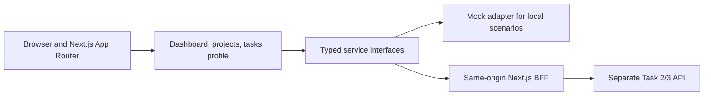

# DevDash Task 1: Developer Productivity Dashboard

A responsive frontend for tracking project progress, deadlines, team activity, and assigned work. This Task 1 submission runs with deterministic mock data and can connect to the separately submitted API through a typed HTTP adapter.

**Repository:** [Task 1 dashboard](https://github.com/Aime-Serge/innovation-hacks-task1-dashboard) · **Deployment:** Not published · **Demo video:** Pending · **LinkedIn post:** Pending


## Features and user workflows

- **Dashboard overview:** open `/dashboard` to review active-project, open-task, overdue-task, and completion KPIs, deadlines due in the next week, and recent activity. Each data region has its own loading, empty, error, and retry behavior.
- **Find project work:** open **Projects**, search by project name, filter by status, and sort the results. Project cards show their status, deadline, owner, and task completion progress. Select a card to see its tasks and recent activity.
- **Manage tasks:** open **Tasks**, search titles, combine status, priority, project, and assignee filters, then sort the results. Filters are encoded in the URL, so reloading or sharing that URL preserves the view. Create a task, assign a teammate, change its status, or remove it through a confirmation step.
- **Sign in or join:** the welcome page's **Login** and **Join** actions both open `/login`. From there, **Create account** opens the two-step registration form. Protected work pages send signed-out visitors to login and preserve their destination.
- **Profile and preferences:** view or edit the signed-in member's professional profile, see a member profile, and update account, privacy, theme, and preference settings.
- **Responsive navigation:** desktop uses persistent navigation; mobile opens the same destinations in an accessible drawer. Light and dark themes are available.
- **Demo scenarios:** with the mock adapter, use the scenario control to inspect default, loading, empty, error, and edge-case data without an API.

## Beyond the Task 1 requirements

- URL-synced filters make project and task views reloadable and shareable ([task query state](src/features/tasks/useTaskQuery.ts), [project query state](src/features/projects/useProjectQuery.ts)).
- Independent dashboard regions keep one failed request from replacing all dashboard content ([dashboard view](src/features/dashboard/DashboardView.tsx)).
- HTTP and mock implementations share typed service interfaces, so the frontend can be demonstrated locally and integrated with the API ([service adapters](src/adapters/)).

## Technology stack

| Layer | Technology |
| --- | --- |
| Web application | Next.js 16.3.4 App Router, React 19.2.8, TypeScript 5.9.3 |
| Styling and accessible primitives | Tailwind CSS 4.3.3, Radix UI 1.6.7 |
| Server state | TanStack Query 5.103.1 |
| Contracts and validation | OpenAPI, `openapi-typescript` 7.13.0, Zod 4.6.5 |
| UI and browser checks | Vitest 5.0.1, Testing Library 16.3.3, Playwright 1.63.0, axe |

## Architecture


```mermaid
flowchart LR
  Browser[Browser and Next.js App Router] --> Features[Dashboard, projects, tasks, profile]
  Features --> Services[Typed service interfaces]
  Services --> Mock[Mock adapter for local scenarios]
  Services --> BFF[Same-origin Next.js BFF]
  BFF --> API[Separate Task 2/3 API]
```

The App Router renders the frontend and protects application routes. Feature components call typed service interfaces rather than depending on a specific data source. The mock adapter provides seeded demo scenarios; the HTTP adapter sends requests through the same-origin BFF, which keeps session tokens out of browser JavaScript.

## Getting started

**Prerequisites:** Node.js 22 or newer and npm.

```bash
npm ci
NEXT_PUBLIC_DATA_SOURCE=mock npm run dev
```

Open [http://localhost:3000](http://localhost:3000). The mock mode is the supported standalone demo and needs no API credentials.

To use the HTTP adapter, copy `.env.example` to `.env.local`, set the API origin and site origin for your local environment, then run `npm run dev` without `NEXT_PUBLIC_DATA_SOURCE=mock`.

### Environment variables

| Variable | Purpose | Example |
| --- | --- | --- |
| `NEXT_PUBLIC_DATA_SOURCE` | Select `mock` for standalone demo; omit for HTTP mode | `mock` |
| `API_BASE_URL` | Upstream API origin for the server-side BFF | `<set-me>` |
| `SITE_URL` | This frontend's origin, used for write-request origin checks | `<set-me>` |
| `BFF_TIMEOUT_MS` | Upstream request timeout, from 1,000 to 60,000 ms | `28000` |
| `ALLOW_INSECURE_COOKIES` | Local HTTP development only | `true` |
| `APP_ENV` | Set to `development` for local HTTP configuration | `development` |

See [.env.example](.env.example); use placeholders only and never commit `.env.local`.

## Quality checks

Run checks individually with `npm run typecheck`, `npm run lint`, `npm test`, `npm run test:e2e`, and `npm run test:a11y`. `npm run gate` runs the full project gate. None of those results are claimed by this README; attach the output captured from the submission commit when preparing the release.

Refresh the reproducible UI evidence against a running mock-mode server with:

```bash
NEXT_PUBLIC_DATA_SOURCE=mock npm run dev
npm run screenshots
```

## Screenshots

The screenshots below use a synthetic demo identity. Desktop captures use 1440 × 900; mobile captures use 390 × 844. They are grouped by the workflow they demonstrate.

### Welcome and account access

| Welcome | Login | Registration |
| --- | --- | --- |
|  |  |  |
|  |  |  |

### Dashboard and system states

| Dashboard, desktop | Dashboard, mobile | Dark theme |
| --- | --- | --- |
|  |  |  |

| Loading | Empty | Error with retry |
| --- | --- | --- |
|  |  |  |

### Project, task, and people workflows

| Projects | Project detail | Filtered tasks |
| --- | --- | --- |
|  |  |  |

| Filtered tasks, mobile | Profile | Team member profile |
| --- | --- | --- |
|  |  |  |

### Navigation and preferences

| Mobile navigation drawer | Account settings |
| --- | --- |
|  |  |

The standards also ask for a saved accessibility report. The repository currently has automated axe coverage in `tests/a11y/axe.spec.ts`; a release-ready saved report still needs to be generated and reviewed.

## Project documentation

- [API contract snapshot](docs/api/openapi.json) and [generated TypeScript API types](src/generated/api-types.ts)
- [Architecture decision records](docs/adr/README.md)
- [Task traceability](docs/traceability.md)
- [Demo walkthrough script](DEMO_SCRIPT.md)
- [Security notes](SECURITY.md)

## Task submission links

| Item | Status / link |
| --- | --- |
| GitHub repository | [innovation-hacks-task1-dashboard](https://github.com/Aime-Serge/innovation-hacks-task1-dashboard) |
| Task 1 release | Pending |
| Demo video | Pending |
| Live deployment | Not published |
| LinkedIn post tagging Innovation Hacks | Pending |

## Acknowledgements

Built for the Innovation Hacks Full Stack Development Internship. The internship guide defines Task 1 as a responsive developer productivity dashboard with navigation, project/task progress, search and filters, and useful loading/empty states.
